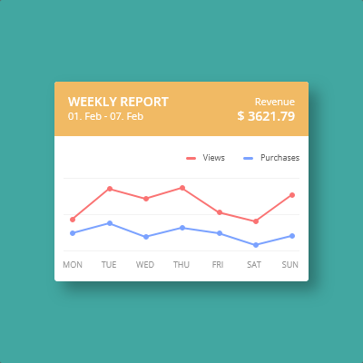

# 📊 Interactive Weekly Report Dashboard

This project is a clean, interactive, and fully responsive weekly report dashboard built with **HTML** and **CSS**. It showcases revenue statistics and visual data like views and purchases through a dynamic line graph.

## 🚀 Features

- **Revenue Overview**: Displays total revenue for the week.
- **Dynamic Line Graph**: Visualizes views and purchases trends for each day of the week.
- **Responsive Design**: Works seamlessly across all devices.
- **Hover Tooltips**: Hover over data points to see exact values.

## 💻 Demo

Here’s a visual of the dashboard layout:



## 🛠️ Technologies Used

- **HTML**: For the structure and layout.
- **CSS**: For styling and animations.

## 📂 Project Structure

```plaintext
├── index.html     # Main HTML file
├── styles.css     # CSS for styling the dashboard
└── README.md      # Project documentation
```